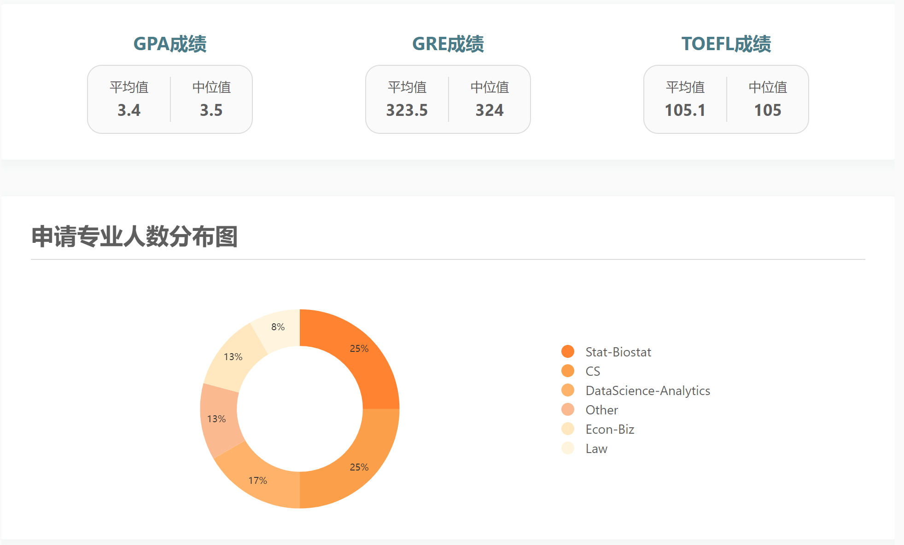
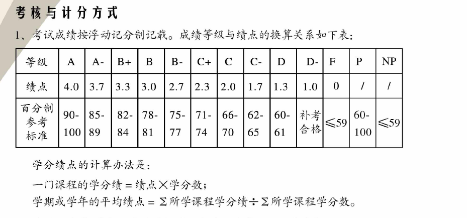
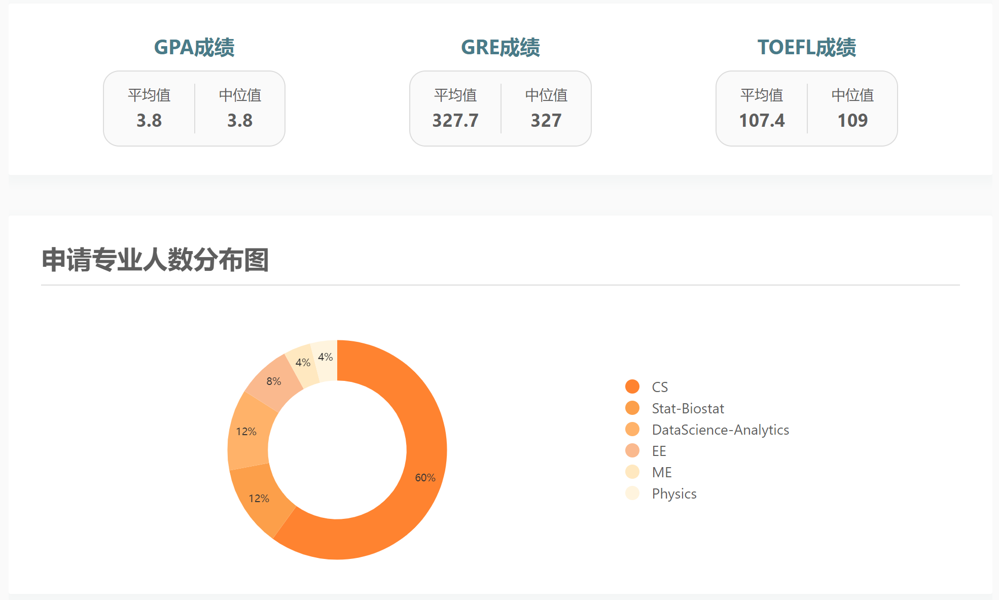
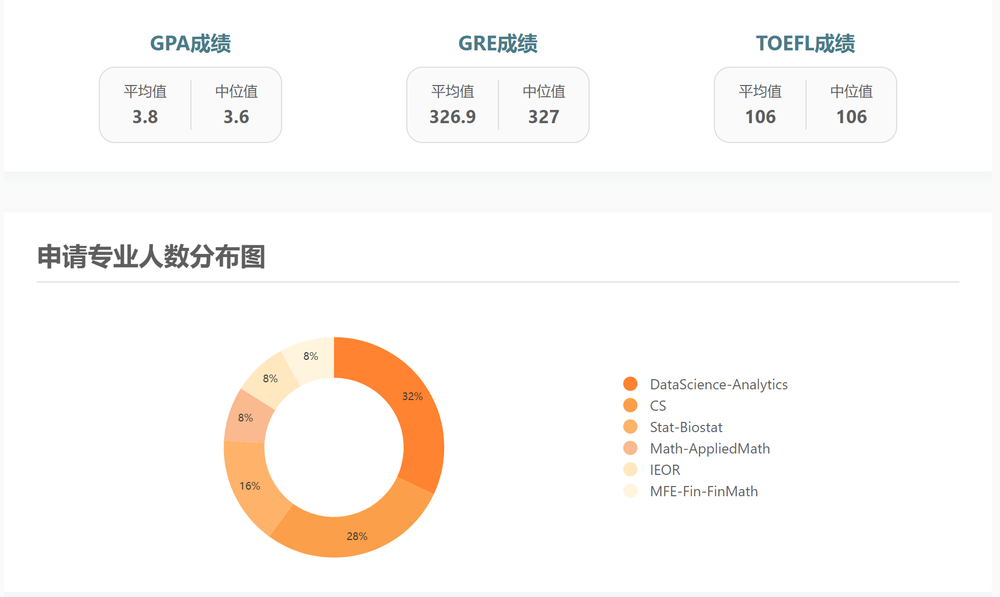
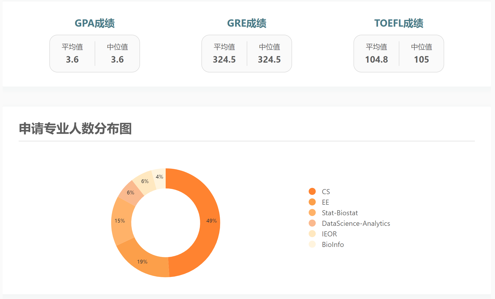
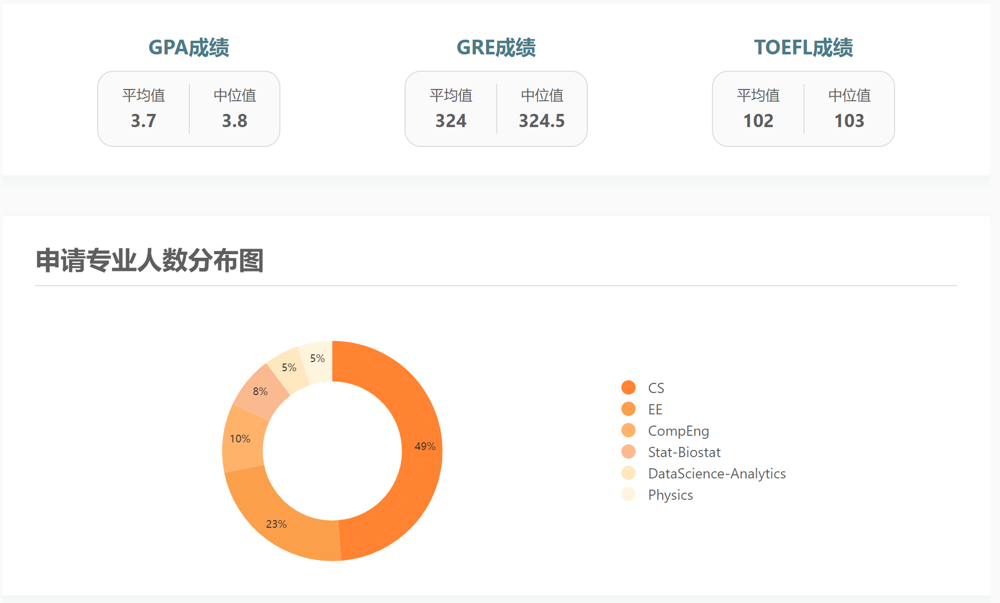
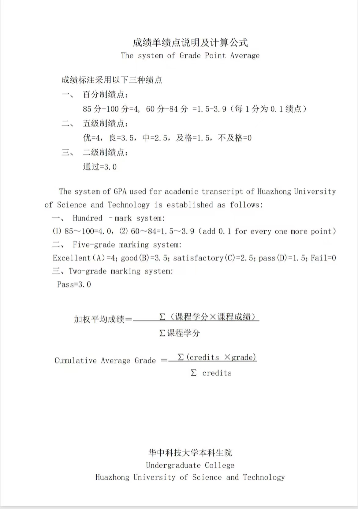

# 学校的GPA制度和数据

（草稿，待继续整理）

## FDU
### 申请数据
来源：一亩三分地  

### 赋分制度

### 真实数据点
- 18CS, 50%, 3.37

## THU
### 申请数据
来源：一亩三分地  

## PKU
### 申请数据
来源：一亩三分地  

## ZJU
### 申请数据
来源：一亩三分地  

## SJTU
### 申请数据
来源：一亩三分地  

## HUST
### 申请数据
来源：一亩三分地  

### 绩点制度

### 真实数据点
- 18MS, 60%, 3.69